# DATN_GearUp - Entity Relationship Diagram (ERD)

## Database Schema for Shoe Store Management System

Based on the project structure and Vue.js frontend components, this ERD represents the complete database design for the DATN_GearUp shoe store management system.

---

## 📊 ERD Diagram (Mermaid)

```mermaid
erDiagram
    %% Users and Authentication
    USERS {
        int id PK
        string email UK
        string username UK
        string password_hash
        string full_name
        string phone
        enum user_type "admin,employee,customer"
        boolean is_active
        datetime created_at
        datetime updated_at
        datetime last_login
    }

    %% Products Management
    CATEGORIES {
        int id PK
        string name UK
        string slug UK
        text description
        string image_url
        boolean is_active
        int sort_order
        datetime created_at
        datetime updated_at
    }

    BRANDS {
        int id PK
        string name UK
        string slug UK
        text description
        string logo_url
        string website_url
        boolean is_active
        datetime created_at
        datetime updated_at
    }

    PRODUCTS {
        int id PK
        string code UK "Product SKU"
        string name
        text description
        int category_id FK
        int brand_id FK
        decimal price "Current selling price"
        decimal original_price "Original price before discount"
        int stock_quantity
        int min_stock_level "Minimum stock alert level"
        enum status "active,inactive,discontinued"
        json sizes "Available sizes array"
        json colors "Available colors array"
        string main_image_url
        json additional_images "Array of image URLs"
        decimal weight "Product weight in kg"
        json specifications "Technical specifications JSON"
        float rating_average "Average customer rating"
        int review_count "Number of reviews"
        int view_count "Product view counter"
        boolean is_featured
        datetime created_at
        datetime updated_at
    }

    PRODUCT_VARIANTS {
        int id PK
        int product_id FK
        string size
        string color
        string sku UK "Variant specific SKU"
        int stock_quantity
        decimal price_adjustment "Price difference from base product"
        boolean is_active
        datetime created_at
        datetime updated_at
    }

    %% Customer Management
    CUSTOMERS {
        int id PK
        int user_id FK
        date date_of_birth
        enum gender "male,female,other"
        string address
        string city
        string district
        string ward
        string postal_code
        enum customer_tier "bronze,silver,gold,platinum"
        decimal total_spent "Total amount spent"
        int total_orders "Number of orders placed"
        datetime last_order_date
        json preferences "Customer preferences JSON"
        boolean receives_marketing_emails
        datetime created_at
        datetime updated_at
    }

    %% Employee Management
    EMPLOYEES {
        int id PK
        int user_id FK
        string employee_code UK
        enum role "admin,manager,staff,cashier"
        decimal salary
        date start_date
        date end_date "null if still employed"
        enum employment_status "active,inactive,terminated,suspended"
        string department
        string position
        int manager_id FK "Self-reference to EMPLOYEES"
        json permissions "Role permissions JSON"
        datetime created_at
        datetime updated_at
    }

    %% Order Management
    ORDERS {
        int id PK
        string order_number UK "Generated order number"
        int customer_id FK
        int employee_id FK "Employee who processed the order"
        decimal subtotal "Sum of all items before discounts"
        decimal discount_amount "Total discount applied"
        decimal tax_amount "Tax amount"
        decimal shipping_fee
        decimal total_amount "Final amount to pay"
        enum status "pending,confirmed,processing,shipping,delivered,completed,cancelled,returned"
        enum payment_status "pending,paid,partial,refunded,failed"
        enum payment_method "cash,card,bank_transfer,e_wallet"
        string payment_reference "Payment transaction reference"
        text shipping_address
        string customer_phone
        string customer_email
        text notes "Order notes"
        datetime order_date
        datetime confirmed_at
        datetime shipped_at
        datetime delivered_at
        datetime created_at
        datetime updated_at
    }

    ORDER_ITEMS {
        int id PK
        int order_id FK
        int product_id FK
        int product_variant_id FK "null if no specific variant"
        string product_name "Snapshot of product name at order time"
        string product_sku "Snapshot of SKU at order time"
        int quantity
        decimal unit_price "Price per unit at order time"
        decimal discount_amount "Discount applied to this item"
        decimal total_price "quantity * unit_price - discount_amount"
        json product_snapshot "Snapshot of product details at order time"
        datetime created_at
        datetime updated_at
    }

    %% Discounts and Promotions
    DISCOUNTS {
        int id PK
        string name
        text description
        enum type "percentage,fixed_amount"
        decimal value "Discount value (percentage or fixed amount)"
        enum applicable_type "all,category,product,brand"
        json applicable_ids "IDs of categories/products/brands if applicable"
        decimal min_order_value "Minimum order value to apply discount"
        decimal max_discount_amount "Maximum discount amount for percentage type"
        datetime start_date
        datetime end_date
        int usage_limit "null for unlimited"
        int usage_count "Current usage count"
        boolean is_active
        int created_by FK "Employee who created the discount"
        datetime created_at
        datetime updated_at
    }

    COUPONS {
        int id PK
        string code UK "Coupon code"
        string name
        text description
        enum type "percentage,fixed_amount,free_shipping"
        decimal value "Coupon value"
        decimal min_order_value "Minimum order value to use coupon"
        decimal max_discount_amount "Maximum discount for percentage coupons"
        int max_uses "Maximum number of uses, null for unlimited"
        int used_count "Current usage count"
        int max_uses_per_customer "Maximum uses per customer"
        datetime expiry_date
        boolean is_active
        json applicable_products "Array of applicable product IDs, null for all"
        json applicable_categories "Array of applicable category IDs, null for all"
        int created_by FK "Employee who created the coupon"
        datetime created_at
        datetime updated_at
    }

    COUPON_USAGE {
        int id PK
        int coupon_id FK
        int order_id FK
        int customer_id FK
        decimal discount_amount "Actual discount amount applied"
        datetime used_at
    }

    %% Inventory Management
    INVENTORY_TRANSACTIONS {
        int id PK
        int product_id FK
        int product_variant_id FK "null if for main product"
        enum transaction_type "in,out,adjustment,return,damage"
        int quantity "Positive for in, negative for out"
        decimal unit_cost "Cost per unit for incoming inventory"
        string reference_number "PO number, order number, etc."
        text notes "Transaction notes"
        int created_by FK "Employee who made the transaction"
        datetime transaction_date
        datetime created_at
    }

    STOCK_ALERTS {
        int id PK
        int product_id FK
        int product_variant_id FK "null if for main product"
        enum alert_type "low_stock,out_of_stock,overstock"
        int current_stock
        int threshold_value
        boolean is_resolved
        datetime alert_date
        datetime resolved_at
        int resolved_by FK "Employee who resolved the alert"
    }

    %% Customer Reviews and Ratings
    PRODUCT_REVIEWS {
        int id PK
        int product_id FK
        int customer_id FK
        int order_id FK "Order in which product was purchased"
        int rating "1-5 stars"
        string title
        text review_text
        json images "Array of review image URLs"
        boolean is_verified_purchase
        boolean is_approved
        int helpful_count "Number of helpful votes"
        datetime reviewed_at
        datetime approved_at
        int approved_by FK "Employee who approved the review"
        datetime created_at
        datetime updated_at
    }

    %% System Logs and Audit
    ACTIVITY_LOGS {
        int id PK
        int user_id FK "User who performed the action"
        string action_type "create,update,delete,login,logout,etc."
        string entity_type "product,order,customer,etc."
        int entity_id "ID of the affected entity"
        json old_values "Previous values before change"
        json new_values "New values after change"
        string ip_address
        string user_agent
        datetime created_at
    }

    %% Relationships
    USERS ||--o{ EMPLOYEES : "has employee profile"
    USERS ||--o{ CUSTOMERS : "has customer profile"
    
    CATEGORIES ||--o{ PRODUCTS : "belongs to"
    BRANDS ||--o{ PRODUCTS : "manufactured by"
    
    PRODUCTS ||--o{ PRODUCT_VARIANTS : "has variants"
    PRODUCTS ||--o{ ORDER_ITEMS : "ordered as"
    PRODUCTS ||--o{ PRODUCT_REVIEWS : "reviewed"
    PRODUCTS ||--o{ INVENTORY_TRANSACTIONS : "affects inventory"
    PRODUCTS ||--o{ STOCK_ALERTS : "triggers alerts"
    
    PRODUCT_VARIANTS ||--o{ ORDER_ITEMS : "specific variant ordered"
    PRODUCT_VARIANTS ||--o{ INVENTORY_TRANSACTIONS : "variant inventory"
    PRODUCT_VARIANTS ||--o{ STOCK_ALERTS : "variant alerts"
    
    CUSTOMERS ||--o{ ORDERS : "places orders"
    CUSTOMERS ||--o{ PRODUCT_REVIEWS : "writes reviews"
    CUSTOMERS ||--o{ COUPON_USAGE : "uses coupons"
    
    EMPLOYEES ||--o{ ORDERS : "processes orders"
    EMPLOYEES ||--o{ DISCOUNTS : "creates discounts"
    EMPLOYEES ||--o{ COUPONS : "creates coupons"
    EMPLOYEES ||--o{ INVENTORY_TRANSACTIONS : "records transactions"
    EMPLOYEES ||--o{ STOCK_ALERTS : "resolves alerts"
    EMPLOYEES ||--o{ PRODUCT_REVIEWS : "approves reviews"
    EMPLOYEES ||--o{ EMPLOYEES : "manages (self-reference)"
    
    ORDERS ||--o{ ORDER_ITEMS : "contains items"
    ORDERS ||--o{ COUPON_USAGE : "uses coupons"
    ORDERS ||--o{ PRODUCT_REVIEWS : "can be reviewed"
    
    COUPONS ||--o{ COUPON_USAGE : "usage tracking"
    
    USERS ||--o{ ACTIVITY_LOGS : "performs actions"
```



---

## 🏗️ Database Design Principles

### 1. **Normalization**
- All tables are normalized to 3NF to eliminate redundancy
- Foreign keys maintain referential integrity
- Junction tables handle many-to-many relationships

### 2. **Audit Trail**
- All major tables include `created_at` and `updated_at` timestamps
- `ACTIVITY_LOGS` table tracks all system changes
- Order items store product snapshots to preserve historical data

### 3. **Flexibility**
- JSON columns for variable data (product specifications, permissions, etc.)
- Extensible enum values for status fields
- Support for product variants (size, color combinations)

### 4. **Performance Considerations**
- Appropriate indexes on foreign keys and frequently queried columns
- Denormalized fields where necessary (rating_average, total_spent, etc.)
- Separate tables for high-volume data (inventory_transactions, activity_logs)

---

## 📋 Key Entity Descriptions

### **PRODUCTS**
Core product catalog with support for variants, inventory tracking, and customer reviews.

### **ORDERS & ORDER_ITEMS**
Complete order management with status tracking, payment information, and item-level details.

### **CUSTOMERS & EMPLOYEES**
User management with role-based access control and detailed profile information.

### **DISCOUNTS & COUPONS**
Flexible promotion system supporting various discount types and usage limitations.

### **INVENTORY_TRANSACTIONS**
Complete inventory tracking with transaction history and stock alerts.

### **PRODUCT_REVIEWS**
Customer review system with ratings, verification, and moderation capabilities.

---

## 🔧 Implementation Notes

### **Database Technology Recommendations:**
1. **PostgreSQL** - Best choice for complex queries and JSON support
2. **MySQL 8.0+** - Good performance with JSON column support
3. **SQL Server** - Enterprise features for large-scale deployments

### **Required Indexes:**
```sql
-- Performance-critical indexes
CREATE INDEX idx_products_category_brand ON products(category_id, brand_id);
CREATE INDEX idx_orders_customer_status ON orders(customer_id, status);
CREATE INDEX idx_order_items_order_product ON order_items(order_id, product_id);
CREATE INDEX idx_inventory_product_date ON inventory_transactions(product_id, transaction_date);
CREATE UNIQUE INDEX idx_product_variants_sku ON product_variants(sku);
CREATE INDEX idx_coupons_code_active ON coupons(code, is_active);
```

### **Data Constraints:**
- Email uniqueness across all users
- Product codes (SKUs) must be unique
- Order numbers auto-generated with specific format
- Stock quantities cannot be negative
- Rating values constrained between 1-5

---

## 🚀 Migration Strategy

1. **Phase 1:** Core entities (Users, Products, Categories, Brands)
2. **Phase 2:** Order management (Orders, Order Items)
3. **Phase 3:** Customer features (Reviews, Coupons)
4. **Phase 4:** Advanced features (Inventory, Analytics, Logs)

This ERD provides a solid foundation for the DATN_GearUp shoe store management system, supporting all the features evident in the Vue.js frontend while maintaining scalability and data integrity.
